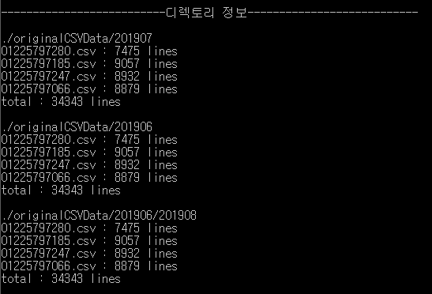
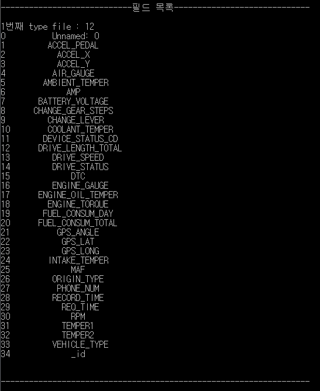
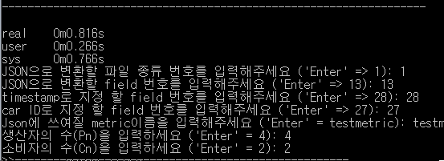
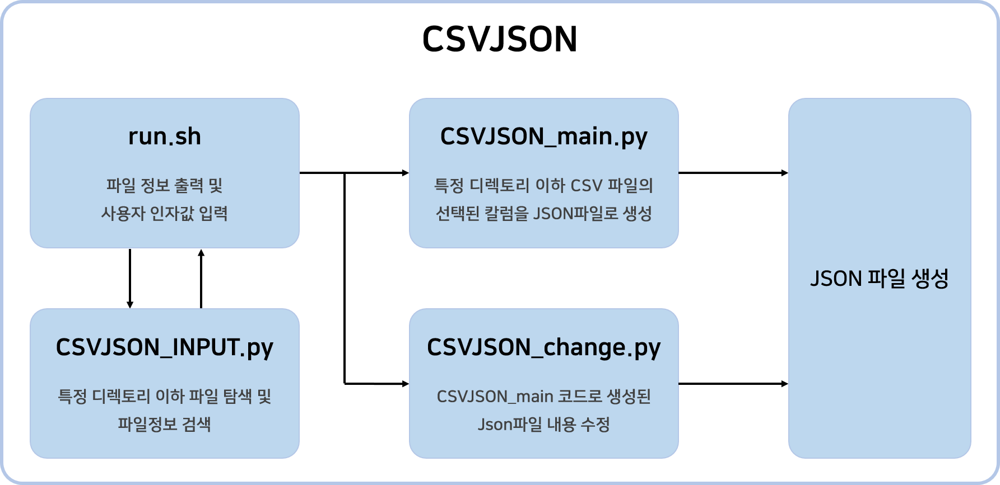
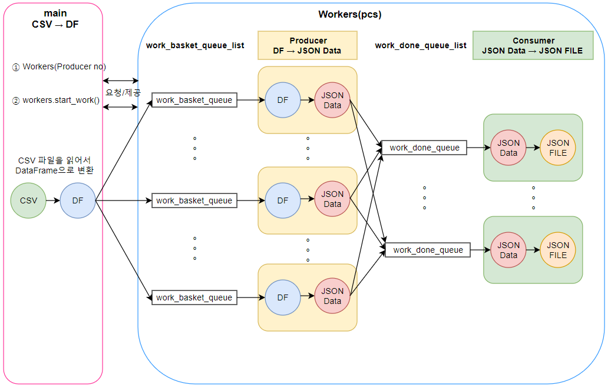

# CSV2JSON 소프트웨어
2019년 전자부품연구원(https://www.keti.re.kr/rnd/rnd01_05.php) 임베디드SW연구센터 에서 개발된 공개 소프트웨어 입니다
## 개요
- IoT 데이터 수집, 빅데이터 분석을 위한 처리 및 JSON 생성 소프트웨어
- 텍스트 CSV 파일을 input 받아 JSON 파일 생성

### 주요 기능
1. 입력 CSV 파일의 필드 이름을 분석 
2. 디렉토리 내의 CSV 파일 갯수 카운트
3. 디렉토리 내의 CSV 파일 종류 (필드이름 다른경우) 카운트
4. JSON 으로 변환할 필드정보 출력 및 사용자 선택 받음
5. 멀티프로세싱 적용 (CSV 로딩, 필드추출, JSON 변환후 파일 저장)
6. 멀티프로세싱을 위한 프로세서 갯수 설정 기능
7. 변환된 JSON파일의 데이터 정보(필드, metric, tags의 key/value) 수정

### 주요 아이디어
- 대용량의 CSV 파일을 멀티 처리 가능함
- 200GB 규모의 CSV 파일 테스트
- 멀티프로세싱으로 CPU 자원을 최대한 사용할 수 있도록 설정 가능
- In-Memory 테스트 결과, 최근 SATA 기술과 속도차이 거의 동일 99% 수준
- 여러가지 종류의 CSV 파일도 처리 가능
- 대용량의 CSV 파일을 처리 중에 발생할 수 있는 오류 CSV 검색, 확인 가능

## 초기 개발자
- 채철승, Chulseung Chae, KETI ( https://github.com/ChulseoungChae )
- 김형구, Hyungkoo Kim, KETI ( https://github.com/KimHyeongGoo )
- 강정훈, Jeonghoon Kang, KETI ( https://github.com/jeonghoonkang )

## 설치방법 
- TBD

## 실행 방법
- run.sh 을 실행하면 됩니다. (예, bash run.sh)
  - 실행관련 상세 내용
    - python CSVJSON_INPUT.py file_type input_dir
      - file_type (csv)
      - input_dir (원본 csv파일이 존재하는 디렉토리)
    - python CSVJSON_main.py filetype jsonpack filekind field ts carid metric outdir pn cn 
      - file type (csv)
      - bundle (파일로 묶을 json data 갯수)
      - filekind (filed 목록별로 분류된 파일 종류 번호 (1,2,3,...) )
      - field (처리할 field index)
      - ts (저장될 timestamp field index)
      - carid (저장될 car number field index)
      - metric (json파일 변환시 저장될 metric명)
      - outdir (json파일이 저장될 경로)
      - pn (생산자 프로세스의 수)
      - cn (소비자 프로세스의 수)
    - python $MainCode rename_field strold strnew
      - rename_field (수정할 key or value)
      - strold (수정할 key/value의 string)
      - strnew (수정될 key/value의 string)
    
    - 실행화면
      1. 각 디렉토리별 csv파일 정보 화면
      - 
      2. csv 필드 목록 화면
      - 
      3. 사용자 입력 화면
      - 

## 코드 실행 순서 및 설명

### 전체 코드 동작
  - 모식도
  
  
### 각 파일 설명
1. run.sh : 
- 각 파이썬 파일을 실행시켜주고 사용자로부터 입력을 받음
    
2. CSVJSON_INPUT.py : 
- 모든 디렉토리의 CSV/excel 파일을 찾고 데이터프레임으로 만들어 칼럼에 따라 분류된 파일 종류와 칼럼들을 출력하여 사용자에게 보여줌
     
3. CSVJSON_main.py : 
- ../originalCSVData/ 디렉토리(또는 사용자 지정 디렉토리)와 하위 디렉토리안의 모든 CSV 파일 중 선택한 입력파일 종류만 읽어 선택된 칼럼의 데이터 처리
- OpenTSDB에 입력할 수 있는 Json형식으로 변환
- 멀티 프로세싱 처리
  - main (CSV file -> DF)
    - CSV 파일들을 하나씩 읽어서 DataFrame으로 변환
    - DataFrame을 생산자 프로세스 수(Pn)만큼 분할 하여 각 생산자 프로세스 큐(work_basket_queue)에 전달
  - Producer Process (DF -> Json Data)
    - 처리 시간이 가장 긴 단계로 사용자로부터 프로세스 갯수를 입력받음
    - 큐에서 분할된 dataFrame을 받은 후 JsonData로 변환후 buffer에 저장
    - buffer를 소비자 프로세스 큐(work_done_queue)에 전달
  - Consumer Process (Json Data -> JsonFile)
    - 각 큐에서 받은 buffer를 모두 합친 후 Json file로 저장
    - 멀티 프로세스 적용(프로세스 수(Cn)를 사용자로 부터 입력받을 수 있음)
    - Producer Process들의 처리 결과가 각 work_done_queue(1,2,...,n)에 순차적으로 전달됨
  - FrameWork
  
     
4. CSVJSON_change.py :
- CSVJSON_main에서 만들어진 json파일의 내용(metric, timestamp, tags등)을 수정해준다.
     
5. type_file.py :
- CSVJSON_INPUT.py 실행시 초기에 만들어 지는 python 파일.
- 필드 목록 출력 runtime을 간소화 하기위해 생성되며 각 파일의 위치와 필드목록을 가지고있는 변수 file_type 딕셔너리와 각 디렉토리의 파일명과 lines수 정보를 가지고 있는 딕셔너리를 가지고 있다.

6. pcs.py & keti_multiprocessing.py
- CSVJSON_main의 멀티프로세서 생성, 관리 및 동작 수행을 처리

7. json_parsing.py
- CSVJSON_change에서 json파일을 수정하기 전 데이터의 일부분을 출력해줌

8. _sw_make_input.txt
- CSVJSON_input.py의 출력 내용을 저장한 텍스트파일
- 콘솔 화면에서 보기 불편할 때 대신 보는 용도

## 개발 목적, 저작권
- 본 S/W는 전자부품연구원 (KETI) 임베디드SW 연구센터에서 2019년 개발되었습니다
- 산업통산자원부와 한국산업기술평가원(KEIT)에서 주관한 2019년 국잭 프로젝트들에서 개발비가 지원되었습니다
- 국책 프로젝트의 사업화 기술 항목은 제외 되었으며, 일반목적 사용이 가능하고 장기적 활용이 가능성이 높은 기능을 공개 하였습니다
- 해당 소프트웨어는 상업용, 비상업 등 모든 사용에 대해 무료 입니다. 이에 따라서 모든 개발자, KETI, KEIT, 산업통산자원부 는 유지보수, 버그관리 등의 사후관리 및 사후지원 책임이 없습니다
- 공개된 코드를 이용하여 새로운 코드, 바이너리, 소프트웨어 등을 개발하고 외부 공개할 때는 개발에 사용한 원본 라이센스파일, 해당 소스코드 파일, 해당 소스코드 개발자의 이름이 반드시 인식 가능하도록 표시되어야 합니다
- 해당 코드를 이용한 기술개발, 기술이전, 교육, 사업화 컨설팅 등의 문의 사항은 KETI 개발자 또는 KETI 기술확산실로 연락 바랍니다
